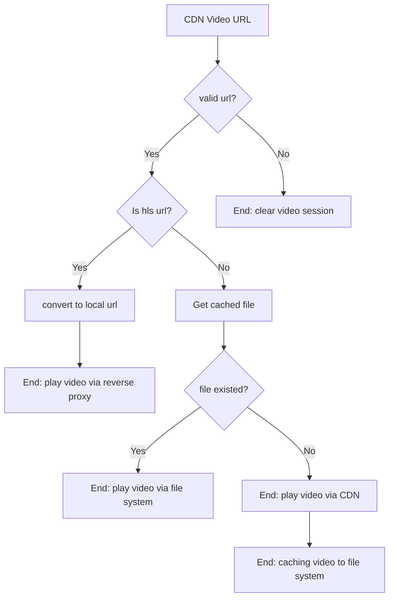
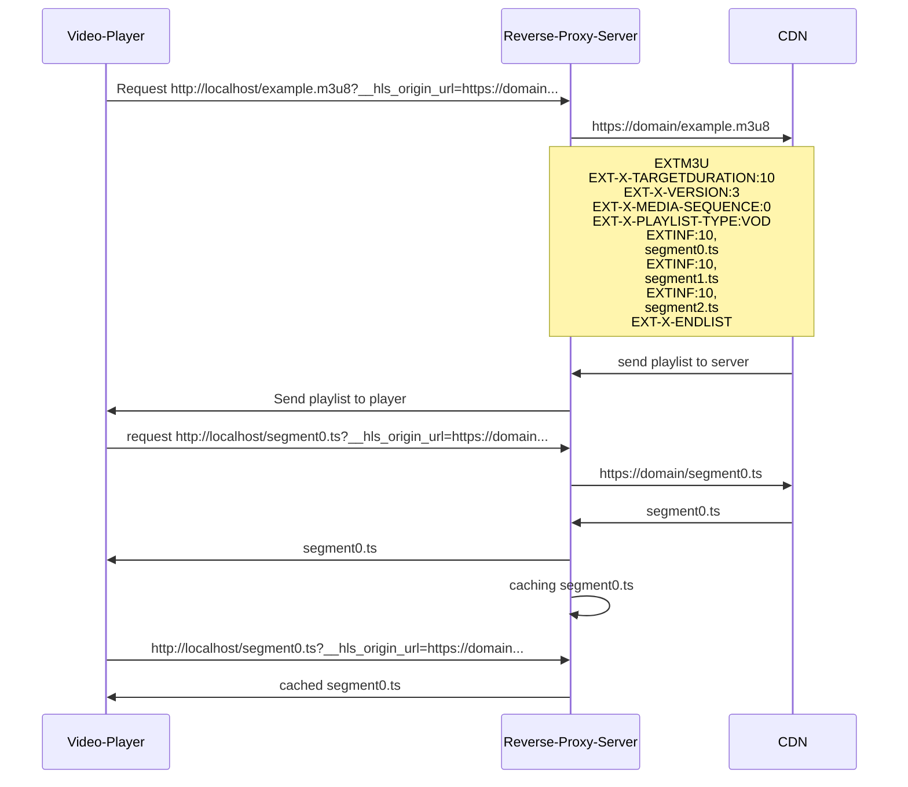

# react-native-cache-video

Support cache video type when playing in Video component

- [x] Download and read video/ hls video from cache
- [x] Cache policy for video for number of video in file system
- [ ] Cache policy for hls video
- [ ] hls caching for dynamic url ( cloudfront)
- [ ] Byte-Range Support for Segments
- [ ] Pre caching for list/ while scrolling

## Installation

with npm

```sh
npm install react-native-blob-util react-native-url-polyfill react-native-cache-video
```

with yarn

```sh
yarn add react-native-blob-util react-native-url-polyfill react-native-cache-video
```

## Usage

Support play with [react-native-video](https://github.com/react-native-video/react-native-video.git)

You can run [example](example/) folder. I give two case using with single video item for viewing in detail and using with list of video

Simple using without provider - don't care about your app memory

- You can clear react-native-cache-video folder in your file system by access cacheManager.cacheFolder from useProxyCacheManager
- This case does not support HLS caching, you need use with Provider

```js
// your customize video component
import { useAsyncCache } from 'react-native-cache-video';

const { setVideoPlayUrlBy, cachedVideoUrl } = useAsyncCache();

React.useEffect(() => {
  setVideoPlayUrlBy(uri);
}, [setVideoPlayUrlBy, uri]);

<Video source={{ uri: cachedVideoUrl }} />;
```

Using with Provider - management your cache memory with custom policy

- use useRef to create your policy for once time :`const freePolicyRef = React.useRef(new FreePolicy())` or using global instance to ignore CacheManagerProvider re-enable memory policy for each time your UI re-render

```js
import {
  CacheManagerProvider,
  FreePolicy,
  LFUPolicy, // last frequency update policy
} from 'react-native-cache-video';
    // provide your component access Cache context
    <CacheManagerProvider cachePolicy={<your policy instance>}>
    {/* your component */}
    </CacheManagerProvider>
```

```js
import { useAsyncCache, HLS_CACHING_RESTART } from 'react-native-cache-video';

// your customize video component
const { setVideoPlayUrlBy, cachedVideoUrl } = useAsyncCache();

React.useEffect(() => {
  const listener = DeviceEventEmitter.addListener(
    HLS_CACHING_RESTART,
    (port: number) => {
      setVideoPlayUrlBy(uri);
    }
  );

  return () => {
    listener.remove();
  };
}, [setVideoPlayUrlBy, uri]);

<Video source={{ uri: cachedVideoUrl }} />;
```

## Flow Diagram

What I use in cache hook



How reverse proxy work



## Contributing

See the [contributing guide](CONTRIBUTING.md) to learn how to contribute to the repository and the development workflow.

## Known Bugs and Future Fixes

- [ ] Cancel mechanism when cache evict
- [x] crash when enter background suddenly

Here is a list of known bugs and issues that we plan to fix in the future:

We welcome contributions to help us fix these issues. Please check the [open issues](link_to_your_issues_page) for more details.

## License

MIT

---

Made with [create-react-native-library](https://github.com/callstack/react-native-builder-bob)
