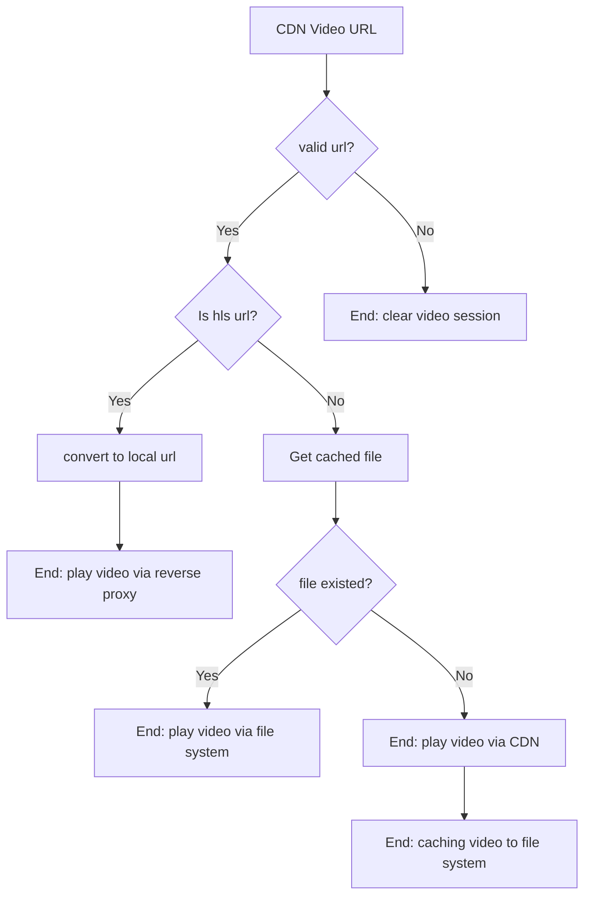
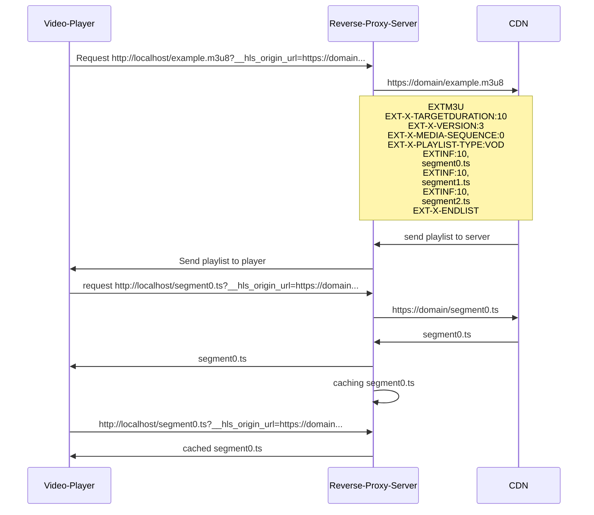

# react-native-cache-video

Support cache video type when playing in Video component

- [x] Download and read video/ hls video from cache
- [x] Cache policy for video for number of video in file system
- [ ] Cache policy for hls video
- [ ] hls caching for dynamic url ( cloudfront)
- [x] Byte-Range Support for Segments
- [ ] Pre caching for list/ while scrolling

## Requirements

**As of v0.4.0 this library is New-Architecture-only.**

- React Native **>= 0.76** (New Architecture / bridgeless — the 0.76 default)
- The old bridge architecture is **not supported**; use v0.3.x on RN < 0.76 / old-arch apps
- Android: Kotlin implementation extending the codegen-generated TurboModule spec (minSdk 24, JDK 17)
- iOS: Obj-C++ TurboModule (iOS >= 15.1); events are emitted through a bridgeless-safe path
- The public JS API is unchanged — events still arrive via `DeviceEventEmitter` (`httpServerResponseReceived` stays internal to the library)

> **Library floor vs. example toolchain:** the published library still supports **RN >= 0.76** (its minimum is unchanged). The bundled `example/` app is pinned to **RN 0.81.6** so it builds under **Xcode 26.4** (iOS 26 SDK) and the current Android 16 / AGP 8.11 toolchain — see the changelog note below.

## Changelog

### 0.4.0 — New Architecture migration (breaking)

- **Breaking:** drops old-bridge support entirely; requires RN >= 0.76 with the New Architecture (bridgeless) enabled
- Android rewritten in Kotlin (`CacheVideoHttpProxyModule`, `BaseReactPackage`, `Server`), extending the codegen-generated `NativeCacheVideoHttpProxySpec`; events now use `ReactContext.emitDeviceEvent`
- iOS emits events via `RCTCallableJSModules` (bridgeless-safe; the old `bridge.eventDispatcher` path silently dropped events under bridgeless), fixes the generated JSI class name, and removes a `dispatch_sync` deadlock hazard in `start`
- Fixed `respond` requestId type in the TurboModule spec (`number` → `string`, matching the actual runtime value); `respond` tolerates a null content-type from HTTP/2 origins
- Removed the leftover `multiply` example method everywhere
- Tooling: AGP 8 / Kotlin 1.9 / JDK 17 / minSdk 24; builder-bob 0.30; podspec collapsed to the modern `install_modules_dependencies` form
- Example app upgraded to RN 0.76 with `newArchEnabled=true`, Flipper removed, react-native-video v6

### Example app — RN 0.81.6 for Xcode 26.4 (toolchain only; library floor stays 0.76)

The bundled `example/` was bumped from RN 0.76.9 → **0.81.6** so it compiles and runs on **Xcode 26.4 (iOS 26 SDK)**. This does **not** change the library's own minimum (still RN 0.76). Verified building on Xcode 26.4 (iOS) and Gradle 8.14.1 / AGP 8.11 / SDK 36 (Android). Changes, all confined to `example/` plus the library's Android gradle defaults:

- `example/package.json`: RN **0.81.6**, React **19.1.4**, `@react-native-community/cli` **20.2.0**, `@react-native/*` **0.81.6**, `react-native-video` **6.19.2**, Node engine **>= 20.19.4**
- Android: SDK/target **36**, buildTools **36**, NDK **27.1.12297006**, Kotlin **2.1.20**, AGP **8.11.0**, Gradle wrapper **8.14.1**, JSC → `io.github.react-native-community:jsc-android`, `edgeToEdgeEnabled=false`
- Library Android gradle defaults aligned to the same Kotlin/AGP/SDK (minSdk unchanged at 24)
- `example/metro.config.js` rewritten to use `react-native-builder-bob/metro-config`'s `getConfig` — Metro 0.83 (RN 0.81) removed the `metro-config/src/defaults/exclusionList` subpath and the `blacklistRE` option the old hand-rolled config relied on. Run Metro with `--reset-cache` once after the bump.
- **Xcode 26 iOS build workarounds** (in `example/ios/Podfile` `post_install`, applied to pod **and** app targets — RN 0.81 still bundles fmt 11.0.2 + Folly 2024.11.18):
  - `FMT_USE_CONSTEVAL=0` — clang ≥ 20 rejects fmt 11.0's `consteval` format checks (+ source patch of `fmt/base.h`)
  - `FOLLY_CFG_NO_COROUTINES=1` — C++20 coroutines make RCT-Folly `Expected.h` include the unvended `folly/coro/Coroutine.h`
  - `FOLLY_HAVE_CLOCK_GETTIME=1` — the iOS 26 SDK now declares `clockid_t`, which Folly's `portability/Time.h` otherwise redefines

## Installation

with npm

```sh
npm install react-native-blob-util react-native-url-polyfill react-native-cache-video
```

with yarn

```sh
yarn add react-native-blob-util react-native-url-polyfill react-native-cache-video
```

### Use with Expo

This library ships a **custom TurboModule** (a native localhost HTTP proxy), so it does **not**
run in **Expo Go**. Use an [Expo Dev Client](https://docs.expo.dev/develop/development-builds/introduction/)
with prebuild (Continuous Native Generation):

1. Install the library and its peers:

   ```sh
   npx expo install react-native-cache-video react-native-blob-util react-native-url-polyfill react-native-video
   ```

2. Add the config plugin to your `app.json` / `app.config.js`:

   ```json
   {
     "expo": {
       "plugins": ["react-native-cache-video"]
     }
   }
   ```

3. Generate the native projects and run a dev build:

   ```sh
   npx expo prebuild
   npx expo run:android   # or: npx expo run:ios
   ```

**What the plugin does** — nothing beyond what the proxy needs, scoped to loopback only:

- **Android:** writes a `network-security-config` that permits cleartext traffic **only** to
  `127.0.0.1` and `localhost` (no blanket `usesCleartextTraffic`), and points
  `<application android:networkSecurityConfig>` at it. If your app already declares one, the
  plugin leaves it untouched and warns.
- **iOS:** adds an App Transport Security exception (`NSExceptionAllowsInsecureHTTPLoads`) for
  `localhost` / `127.0.0.1` only — it does **not** set `NSAllowsArbitraryLoads`.

The TurboModule itself links through standard React Native autolinking, which `expo prebuild`
respects — the plugin adds no autolinking glue.

> A complete, runnable sample lives in [`example-expo/`](./example-expo) (Expo SDK 54, new
> architecture, dev-client).

## Usage

Support play with [react-native-video](https://github.com/react-native-video/react-native-video.git)

You can run [example](example/) folder. I give two case using with single video item for viewing in detail and using with list of video

Simple using without provider - don't care about your app memory

- You can clear react-native-cache-video folder in your file system by access cacheManager.cacheFolder from useProxyCacheManager
- This case does not support HLS caching, you need use with Provider

```js
// your customize video component
import { useAsyncCache } from 'react-native-cache-video';

const { setVideoPlayUrlBy, cachedVideoUrl } = useAsyncCache();

React.useEffect(() => {
  setVideoPlayUrlBy(uri);
}, [setVideoPlayUrlBy, uri]);

<Video source={{ uri: cachedVideoUrl }} />;
```

Using with Provider - management your cache memory with custom policy

- use useRef to create your policy for once time :`const freePolicyRef = React.useRef(new FreePolicy())` or using global instance to ignore CacheManagerProvider re-enable memory policy for each time your UI re-render

```js
import {
  CacheManagerProvider,
  FreePolicy,
  LFUPolicy, // last frequency update policy
} from 'react-native-cache-video';
    // provide your component access Cache context
    <CacheManagerProvider cachePolicy={<your policy instance>}>
    {/* your component */}
    </CacheManagerProvider>
```

```js
import { useAsyncCache, HLS_CACHING_RESTART } from 'react-native-cache-video';

// your customize video component
const { setVideoPlayUrlBy, cachedVideoUrl } = useAsyncCache();

React.useEffect(() => {
  const listener = DeviceEventEmitter.addListener(
    HLS_CACHING_RESTART,
    (port: number) => {
      setVideoPlayUrlBy(uri);
    }
  );

  return () => {
    listener.remove();
  };
}, [setVideoPlayUrlBy, uri]);

<Video source={{ uri: cachedVideoUrl }} />;
```

## Flow Diagram

What I use in cache hook


```mermaid
graph TD
    A[CDN Video URL] --> B{valid url?}
    B -->|Yes| C{Is hls url?}
    B -->|No| L[End: clear video session]
    C -->|Yes| D[convert to local url]
    D --> E[End: play video via reverse proxy]
    C -->|No| F[Get cached file]
    F --> G{file existed?}
    G -->|Yes| H[End: play video via file system]
    G -->|No| I[End: play video via CDN]
    I --> J[End: caching video to file system]
```

How reverse proxy work


```mermaid
sequenceDiagram
    participant VP as Video-Player
    participant RPS as Reverse-Proxy-Server
    participant CDN
    VP->>RPS: Request http://localhost/example.m3u8?__hls_origin_url=https://domain...
    RPS->>CDN: https://domain/example.m3u8
    Note over RPS,CDN: EXTM3U<br/>EXT-X-TARGETDURATION:10<br/>EXT-X-VERSION:3<br/>EXT-X-MEDIA-SEQUENCE:0<br/>EXT-X-PLAYLIST-TYPE:VOD<br/>EXTINF:10,<br/>segment0.ts<br/>EXTINF:10,<br/>segment1.ts<br/>EXTINF:10,<br/>segment2.ts<br/>EXT-X-ENDLIST
    CDN->>RPS: send playlist to server
    RPS->>VP: Send playlist to player
    VP->>RPS: request http://localhost/segment0.ts?__hls_origin_url=https://domain...
    RPS->>CDN: https://domain/segment0.ts
    CDN->>RPS: segment0.ts
    RPS->>VP:  segment0.ts
    RPS->>RPS: caching segment0.ts

    VP->>RPS: http://localhost/segment0.ts?__hls_origin_url=https://domain...
    RPS->>VP: cached segment0.ts

```

## Contributing

See the [contributing guide](CONTRIBUTING.md) to learn how to contribute to the repository and the development workflow.

## Known Bugs and Future Fixes

- [ ] Cancel mechanism when cache evict
- [x] crash when enter background suddenly

Here is a list of known bugs and issues that we plan to fix in the future:

We welcome contributions to help us fix these issues. Please check the [open issues](link_to_your_issues_page) for more details.

## License

MIT

---

Made with [create-react-native-library](https://github.com/callstack/react-native-builder-bob)
