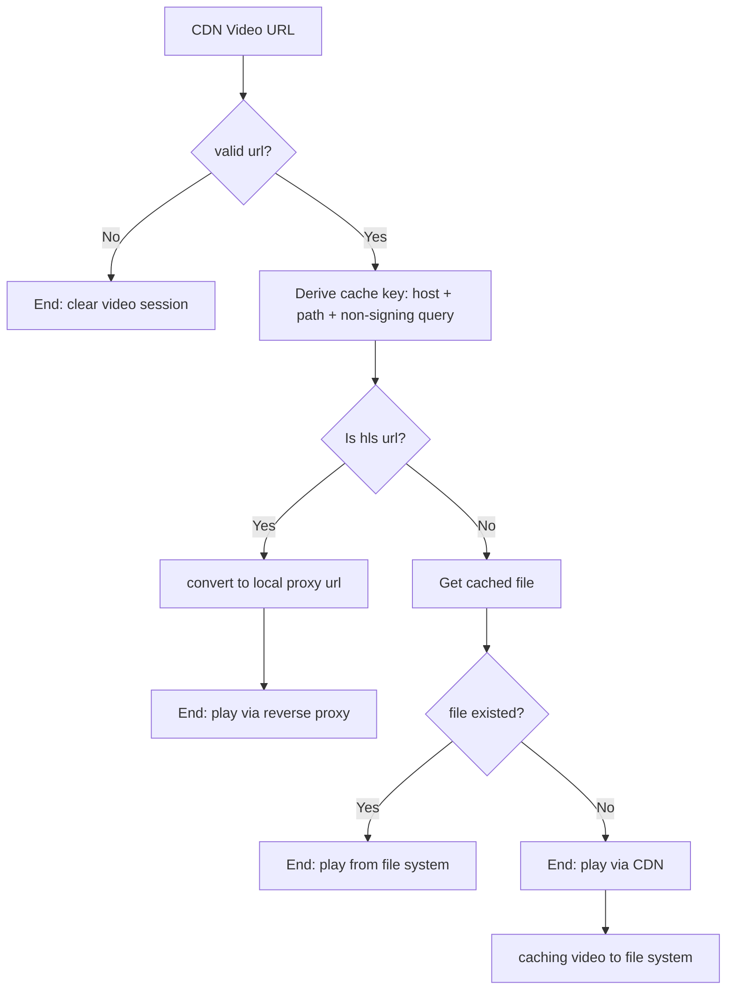
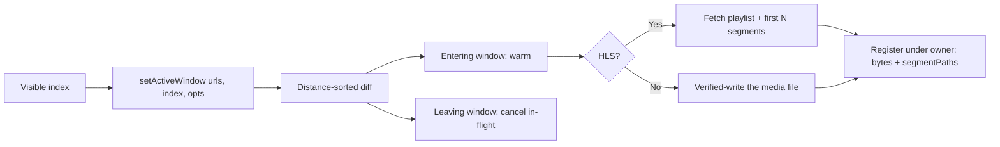
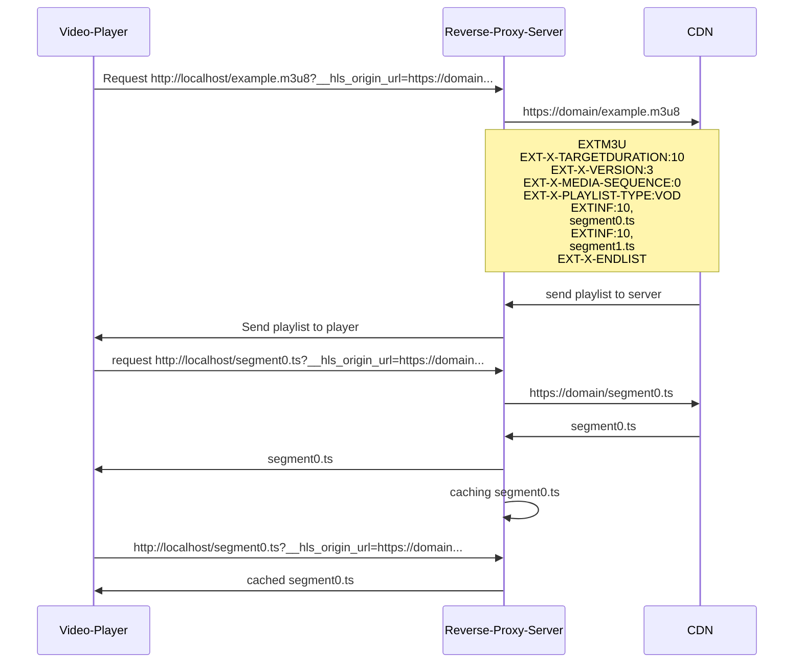

# react-native-cache-video

Support cache video type when playing in Video component

- [x] Download and read video / HLS video from cache
- [x] Cache policy for video, by number of videos in the file system
- [x] Cache policy for HLS video — playlist + segments evicted as one whole asset
- [x] HLS caching for dynamic URLs (CloudFront-signed and similar)
- [x] Pre-caching for a list / while scrolling
- [x] Byte-Range support for segments — see [Byte-range status](#byte-range-status)

> Every ticked box is covered by the jest suite (294 tests). Byte-range was unticked in an earlier
> 0.5.0 draft because `Content-Range` could not be returned; the native bridge now carries
> response headers, so it is complete.

## Requirements

**As of v0.4.0 this library is New-Architecture-only.**

- React Native **>= 0.76** (New Architecture / bridgeless — the 0.76 default)
- The old bridge architecture is **not supported**; use v0.3.x on RN < 0.76 / old-arch apps
- Android: Kotlin implementation extending the codegen-generated TurboModule spec (minSdk 24, JDK 17)
- iOS: Obj-C++ TurboModule (iOS >= 15.1); events are emitted through a bridgeless-safe path
- The public JS API is unchanged — events still arrive via `DeviceEventEmitter` (`httpServerResponseReceived` stays internal to the library)

> **Library floor vs. example toolchain:** the published library still supports **RN >= 0.76** (its minimum is unchanged). The bundled `example/` app is pinned to **RN 0.81.6** so it builds under **Xcode 26.4** (iOS 26 SDK) and the current Android 16 / AGP 8.11 toolchain — see the changelog note below.

## Installation

with npm

```sh
npm install react-native-blob-util react-native-url-polyfill react-native-cache-video
```

with yarn

```sh
yarn add react-native-blob-util react-native-url-polyfill react-native-cache-video
```

### Use with Expo

This library ships a **custom TurboModule** (a native localhost HTTP proxy), so it does **not**
run in **Expo Go**. Use an [Expo Dev Client](https://docs.expo.dev/develop/development-builds/introduction/)
with prebuild (Continuous Native Generation):

1. Install the library and its peers:

   ```sh
   npx expo install react-native-cache-video react-native-blob-util react-native-url-polyfill react-native-video
   ```

2. Add the config plugin to your `app.json` / `app.config.js`:

   ```json
   {
     "expo": {
       "plugins": ["react-native-cache-video"]
     }
   }
   ```

3. Generate the native projects and run a dev build:

   ```sh
   npx expo prebuild
   npx expo run:android   # or: npx expo run:ios
   ```

**What the plugin does** — nothing beyond what the proxy needs, scoped to loopback only:

- **Android:** writes a `network-security-config` that permits cleartext traffic **only** to
  `127.0.0.1` and `localhost` (no blanket `usesCleartextTraffic`), and points
  `<application android:networkSecurityConfig>` at it. If your app already declares one, the
  plugin leaves it untouched and warns.
- **iOS:** adds an App Transport Security exception (`NSExceptionAllowsInsecureHTTPLoads`) for
  `localhost` / `127.0.0.1` only — it does **not** set `NSAllowsArbitraryLoads`.

The TurboModule itself links through standard React Native autolinking, which `expo prebuild`
respects — the plugin adds no autolinking glue.

> A complete, runnable sample lives in [`example-expo/`](./example-expo) (Expo SDK 54, new
> architecture, dev-client). The scrolling-list demo currently lives only in
> [`example/`](./example) (`VideoList`).

## Usage

Support play with [react-native-video](https://github.com/react-native-video/react-native-video.git)

You can run the [example](example/) folder. It shows two cases: a single video item viewed in
detail, and a list of videos.

### 1. Simple — no provider

- Clear the cache folder yourself via `cacheManager.cacheFolder` from `useProxyCacheManager`
- **This case does not support HLS caching** — use the provider for that

```js
// your customize video component
import { useAsyncCache } from 'react-native-cache-video';

const { setVideoPlayUrlBy, cachedVideoUrl } = useAsyncCache();

React.useEffect(() => {
  setVideoPlayUrlBy(uri);
}, [setVideoPlayUrlBy, uri]);

<Video source={{ uri: cachedVideoUrl }} />;
```

### 2. With provider — managed cache and eviction policy

Create the policy once (`useRef`, or a module-level instance) so re-renders don't reset it.

```js
import {
  CacheManagerProvider,
  FreePolicy,
  LFUPolicy, // least-frequently-used, by video COUNT
} from 'react-native-cache-video';

// provide your component access to the Cache context
<CacheManagerProvider cachePolicy={policyInstance}>
  {/* your component */}
</CacheManagerProvider>;
```

`CacheManagerProvider` accepts:

| Prop | Type | Default | Meaning |
|---|---|---|---|
| `cachePolicy` | `MemoryCachePolicyInterface` | `FreePolicy` | eviction strategy |
| `devMode` | `boolean` | `true` | verbose logging |

### 3. Size-bounded eviction for HLS — `LFUSizePolicy`

`LFUPolicy` counts *entries*, which is meaningless for HLS: one playlist plus a hundred segments
is one video but a hundred files. `LFUSizePolicy` bounds the cache by **bytes**, and evicts an
HLS asset as a whole (playlist + every registered segment):

```js
import { CacheManagerProvider, LFUSizePolicy } from 'react-native-cache-video';

const policy = React.useRef(new LFUSizePolicy(500)).current; // capacity in MB

<CacheManagerProvider cachePolicy={policy}>{children}</CacheManagerProvider>;
```

The constructor takes **megabytes** and converts internally to bytes.

### 4. Pre-caching a list while scrolling — `usePrefetch`

`usePrefetch` wires a `FlatList`'s viewability signal into a distance-sorted sliding window.
Items entering the window are warmed; items leaving it are cancelled; prefetch never competes
with active playback.

```jsx
import { usePrefetch } from 'react-native-cache-video';

const urls = items.map((i) => i.uri);

const { currentIndex, onViewableItemsChanged, viewabilityConfig } = usePrefetch(urls, {
  ahead: 3, // warm 3 items ahead of the visible one
  behind: 1, // and 1 behind
  segmentCount: 2, // for HLS: playlist + first N segments
});

<FlatList
  data={items}
  onViewableItemsChanged={onViewableItemsChanged}
  viewabilityConfig={viewabilityConfig}
  renderItem={({ item, index }) => (
    <VideoCell uri={item.uri} paused={index !== currentIndex} />
  )}
/>;
```

Or drive the window directly, without the hook:

```js
import { CacheManager } from 'react-native-cache-video';

cacheManager.setActiveWindow(urls, currentIndex, {
  ahead: 3,
  behind: 1,
  segmentCount: 2,
});
```

**Window options** (`SetActiveWindowOpts`):

| Option | Type | Meaning |
|---|---|---|
| `ahead` | `number` | how many items past `currentIndex` to warm |
| `behind` | `number` | how many items before it to keep warm |
| `segmentCount` | `number` | for an HLS item, how many leading segments to fetch after the playlist |

### 5. Restart events

The proxy re-binds after a background/foreground cycle. Re-resolve your play URL when it does:

```js
import { useAsyncCache, HLS_CACHING_RESTART } from 'react-native-cache-video';

const { setVideoPlayUrlBy, cachedVideoUrl } = useAsyncCache();

React.useEffect(() => {
  const listener = DeviceEventEmitter.addListener(
    HLS_CACHING_RESTART, // 'RNCV_HLS_CACHING_RESTART'
    (port: number) => {
      setVideoPlayUrlBy(uri);
    }
  );

  return () => {
    listener.remove();
  };
}, [setVideoPlayUrlBy, uri]);

<Video source={{ uri: cachedVideoUrl }} />;
```

### 6. Signed / rotating URLs

Cache identity is derived automatically: the URL's **host + path + non-signing query params**,
with signing parameters stripped before hashing. A re-signed CloudFront URL therefore hits the
same cache entry instead of re-downloading.

Stripped by default: `Expires`, `Signature`, `Key-Pair-Id`, `Policy`, `token`, and any
`X-Amz-*` parameter (prefix match, case-insensitive). Every other query parameter is part of
the identity, so two URLs differing in a real parameter stay distinct entries.

> **This is not configurable yet.** The internal policy accepts `denylistParams` and a
> `urlKeyExtractor` escape hatch, but no call site passes them and the module is not exported
> from the package — see [Known limitations](#known-limitations). Earlier changelog drafts
> named `queryAllowlist` / `stripQuery` options; those never existed.

## Master playlists

Most real HLS URLs are **master** playlists: the body lists renditions (`#EXT-X-STREAM-INF`)
pointing at *variant* playlists, and the actual `.ts` media is one level further down.

Prefetch descends that ladder. Given a master, it picks the **lowest advertised `BANDWIDTH`**
rendition — the cheapest bet to place before the player has chosen one, and where HLS players
conventionally start before adapting upward — then warms that variant's first `segmentCount`
segments. Descent is exactly one level, guarded so a malformed self-referential ladder
terminates instead of looping.

> Before this landed, a master playlist's rendition URIs were mistaken for media segments, so
> prefetching a typical stream downloaded five small `.m3u8` files and **no video at all**.
> Verified against `https://test-streams.mux.dev/x36xhzz/x36xhzz.m3u8`: five variants, of which
> the 240p rung resolves to 64 real `.ts` segments.

A media (non-master) playlist is unaffected — it is used directly, with a single fetch.

## Byte-range status

`main` used to forward the player's `Range` header to origin and read/write at a range-suffixed
path. That regressed, and this release restores it:

| Behaviour | Status |
|---|---|
| `Range` header forwarded to origin | ✅ |
| Response body is the ranged bytes, not the whole file | ✅ |
| Cached at the range-suffixed path (next identical range is a disk hit) | ✅ |
| Origin's status code passed through (`206` instead of a hard-coded `200`) | ✅ |
| `Content-Range` returned to the player | ✅ |
| A **cache hit** on a ranged request answers `200`, not `206` | ⚠️ see below |

Returning `Content-Range` required a native change: `respond` previously took
`(requestId, code, type, body)` with no header channel on either platform, so no response header
could be returned from JS at all. It now takes an optional fifth `headersJson` argument, which
both platforms parse defensively — a malformed payload costs the headers, never the response.

> **Known gap — ranged cache hits.** The *first* ranged request is a correct `206` with
> `Content-Range`. A second identical ranged request is served from disk as a **`200`**, because
> the range-suffixed file stores only the range's bytes and the resource's *total* size is not
> persisted, so a truthful `Content-Range: bytes x-y/TOTAL` cannot be reconstructed. Rather than
> invent a total, the cache-hit path omits the header. Players that re-request an identical range
> and require a `206` may re-seek. Persisting the total length in the segment record is the fix,
> and is not in this release.

## Flow Diagram

What the cache hook does:


```mermaid
graph TD
    A[CDN Video URL] --> B{valid url?}
    B -->|No| L[End: clear video session]
    B -->|Yes| K[Derive cache key: host + path + non-signing query]
    K --> C{Is hls url?}
    C -->|Yes| D[convert to local proxy url]
    D --> E[End: play via reverse proxy]
    C -->|No| F[Get cached file]
    F --> G{file existed?}
    G -->|Yes| H[End: play from file system]
    G -->|No| I[End: play via CDN]
    I --> J[caching video to file system]
```

Sliding-window pre-caching:


```mermaid
graph LR
    V[Visible index] --> W[setActiveWindow urls, index, opts]
    W --> S[Distance-sorted diff]
    S --> IN[Entering window: warm]
    S --> OUT[Leaving window: cancel in-flight]
    IN --> P{HLS?}
    P -->|Yes| PL[Fetch playlist + first N segments]
    P -->|No| MP[Verified-write the media file]
    PL --> R[Register under owner: bytes + segmentPaths]
    MP --> R
```

How the reverse proxy works:


```mermaid
sequenceDiagram
    participant VP as Video-Player
    participant RPS as Reverse-Proxy-Server
    participant CDN
    VP->>RPS: Request http://localhost/example.m3u8?__hls_origin_url=https://domain...
    RPS->>CDN: https://domain/example.m3u8
    Note over RPS,CDN: EXTM3U<br/>EXT-X-TARGETDURATION:10<br/>EXT-X-VERSION:3<br/>EXT-X-MEDIA-SEQUENCE:0<br/>EXT-X-PLAYLIST-TYPE:VOD<br/>EXTINF:10,<br/>segment0.ts<br/>EXTINF:10,<br/>segment1.ts<br/>EXT-X-ENDLIST
    CDN->>RPS: send playlist to server
    RPS->>VP: Send playlist to player
    VP->>RPS: request http://localhost/segment0.ts?__hls_origin_url=https://domain...
    RPS->>CDN: https://domain/segment0.ts
    CDN->>RPS: segment0.ts
    RPS->>VP:  segment0.ts
    RPS->>RPS: caching segment0.ts

    VP->>RPS: http://localhost/segment0.ts?__hls_origin_url=https://domain...
    RPS->>VP: cached segment0.ts
```

## Changelog

### 0.5.0 — HLS cache policy, signed-URL caching, list pre-caching, evict-cancel

- **HLS caching for dynamic URLs (CloudFront):** cache identity now strips known signing params
  before hashing (`Expires`, `Signature`, `Key-Pair-Id`, `Policy`, `token`, `X-Amz-*`), folds in
  the **host** (a prior collision risk — only the path used to be hashed), and falls back to the
  original URL if the URL is malformed. Re-signed URLs hit the cache instead of re-downloading.
  Not user-configurable in this release.
- **Cache policy for HLS:** the registry groups an HLS asset (playlist + its segments) into one
  entry with byte totals; `LFUSizePolicy` accounts and evicts whole assets, so segment growth is
  bounded. Segments warmed by the prefetcher are now registered under their owner, so they count
  toward the policy and are cleaned up on evict (previously they were invisible to accounting and
  leaked on eviction). Cached playlists also serve as an offline fallback, rewritten with the live
  proxy port at serve time.
- **Cancel on evict/remove:** in-use assets are pin-refcounted against eviction; a generation guard
  prevents an evicted/removed asset's in-flight download from resurrecting it;
  `removeCachedVideo`/`clearCache` cancel in-flight downloads; all writes go through a verified
  temp→check→promote path; proxy requests always terminate with a response.
- **Origin errors are never cached:** a non-2xx origin response is rejected before promotion and
  its real status is passed through, instead of a 4xx/5xx body being stored as media and later
  served as if it were video.
- **Proxy robustness:** every response body crossing the native bridge is base64-encoded, so a
  plain-text error body can no longer make Android's strict decoder throw and hang the request;
  and the request listener is now a single subscription with an in-flight start guard, so a
  double `enableBridgeServer` can no longer double-dispatch every request.
- **Pre-caching for lists:** `CacheManager.setActiveWindow(urls, currentIndex, opts)` +
  `usePrefetch()` — distance-sorted sliding-window prefetch (`ahead` / `behind` / `segmentCount`),
  HLS items warm the playlist plus the first N segments, items leaving the window are cancelled,
  and prefetch never competes with active playback. Reference wiring in `example/` (`VideoList`).
- **Master-playlist support in prefetch:** a master playlist's renditions are no longer mistaken
  for media segments — prefetch descends one level into the lowest-bandwidth variant and warms
  its real `.ts` segments. See [Master playlists](#master-playlists).
- **Fixed: the proxy served base64 TEXT instead of media.** `Response.send` base64-encodes for the
  native bridge, but media read off disk and playlists from `reverseProxyPlaylist` are *already*
  base64 — so they were encoded twice and every player received text. Bodies that are already
  encoded now go through `sendRaw`. This passed the entire jest suite (double-encoded base64 is
  still valid base64) and was found by curling the running proxy on a simulator.
- **Fixed: a malformed `__hls_origin_url` hung the request forever.** `getOriginURL` threw
  `URIError` on a raw `%`, and a non-URL value reached `react-native-blob-util`, whose promise
  never settled — so no response was ever sent and the player waited indefinitely. Both now answer
  `400 Bad Request` immediately.
- **Byte-range restored, and the native bridge grew a response-header channel.** `Range` is
  forwarded to origin, the ranged variant is cached at its own suffixed path, and the origin's
  `206` + `Content-Range` reach the player. **Native change:** `respond` gained an optional fifth
  `headersJson` argument (`respond(requestId, code, type, body, headersJson?)`) on both platforms
  — a rebuild is required, and any fork that reimplements the TurboModule must add the parameter.
  See [Byte-range status](#byte-range-status) for the one remaining gap.
- **Android proxy can no longer hang on a malformed response.** `Server.respond` previously logged
  and returned when it could not build a response, leaving `serve()` spinning forever on its
  unbounded wait; it now always stores a response, synthesizing a `500` on failure.
- **Upgrade note (soft breaks):** the persisted cache registry is versioned; a pre-0.5.0 registry
  is discarded on first load and orphaned `react-native-cache-video-*` files are swept (one-time
  re-download). Custom `MemoryCachePolicyInterface` / `MemoryCacheDelegate` implementations now
  receive `CacheEntry` values (helpers exported) and the registry `export()` shape changed. The
  documented public API (`useAsyncCache`, `CacheManagerProvider`, policies,
  `preCacheFor` / `preCacheForList`) is unchanged.

### 0.4.0 — New Architecture migration (breaking)

- **Breaking:** drops old-bridge support entirely; requires RN >= 0.76 with the New Architecture (bridgeless) enabled
- Android rewritten in Kotlin (`CacheVideoHttpProxyModule`, `BaseReactPackage`, `Server`), extending the codegen-generated `NativeCacheVideoHttpProxySpec`; events now use `ReactContext.emitDeviceEvent`
- iOS emits events via `RCTCallableJSModules` (bridgeless-safe; the old `bridge.eventDispatcher` path silently dropped events under bridgeless), fixes the generated JSI class name, and removes a `dispatch_sync` deadlock hazard in `start`
- Fixed `respond` requestId type in the TurboModule spec (`number` → `string`, matching the actual runtime value); `respond` tolerates a null content-type from HTTP/2 origins
- Removed the leftover `multiply` example method everywhere
- Tooling: AGP 8 / Kotlin 1.9 / JDK 17 / minSdk 24; builder-bob 0.30; podspec collapsed to the modern `install_modules_dependencies` form
- Example app upgraded to RN 0.76 with `newArchEnabled=true`, Flipper removed, react-native-video v6

### Example app — RN 0.81.6 for Xcode 26.4 (toolchain only; library floor stays 0.76)

The bundled `example/` was bumped from RN 0.76.9 → **0.81.6** so it compiles and runs on **Xcode 26.4 (iOS 26 SDK)**. This does **not** change the library's own minimum (still RN 0.76). Verified building on Xcode 26.4 (iOS) and Gradle 8.14.1 / AGP 8.11 / SDK 36 (Android). Changes, all confined to `example/` plus the library's Android gradle defaults:

- `example/package.json`: RN **0.81.6**, React **19.1.4**, `@react-native-community/cli` **20.2.0**, `@react-native/*` **0.81.6**, `react-native-video` **6.19.2**, Node engine **>= 20.19.4**
- Android: SDK/target **36**, buildTools **36**, NDK **27.1.12297006**, Kotlin **2.1.20**, AGP **8.11.0**, Gradle wrapper **8.14.1**, JSC → `io.github.react-native-community:jsc-android`, `edgeToEdgeEnabled=false`
- Library Android gradle defaults aligned to the same Kotlin/AGP/SDK (minSdk unchanged at 24)
- `example/metro.config.js` rewritten to use `react-native-builder-bob/metro-config`'s `getConfig` — Metro 0.83 (RN 0.81) removed the `metro-config/src/defaults/exclusionList` subpath and the `blacklistRE` option the old hand-rolled config relied on. Run Metro with `--reset-cache` once after the bump.
- **Xcode 26 iOS build workarounds** (in `example/ios/Podfile` `post_install`, applied to pod **and** app targets — RN 0.81 still bundles fmt 11.0.2 + Folly 2024.11.18):
  - `FMT_USE_CONSTEVAL=0` — clang ≥ 20 rejects fmt 11.0's `consteval` format checks (+ source patch of `fmt/base.h`)
  - `FOLLY_CFG_NO_COROUTINES=1` — C++20 coroutines make RCT-Folly `Expected.h` include the unvended `folly/coro/Coroutine.h`
  - `FOLLY_HAVE_CLOCK_GETTIME=1` — the iOS 26 SDK now declares `clockid_t`, which Folly's `portability/Time.h` otherwise redefines

## Known limitations

- **Android downloads are buffered in memory, not streamed to disk.** `react-native-blob-util`
  0.24.10's stream-to-file path truncates every download to exactly 8192 bytes on Android (one Okio
  segment), so nothing larger than 8 KB could ever be cached — no HLS segment, no playback. This
  library works around it by taking the response in memory on Android and writing the file itself.
  The cost is peak memory proportional to the file being fetched, which is fine for HLS segments
  but worth knowing before pre-caching very large MP4s on Android. iOS still streams to disk.
  Upstream cause: `ReactNativeBlobUtilFileResp.ProgressReportingSource.read()` writes each chunk to
  the destination file but never into the Okio `sink`, so the drain loop in
  `ReactNativeBlobUtilReq.done()` sees an empty buffer, treats it as EOF after the first read, and
  `isDownloadComplete()` then fails with "Download interrupted."

Current, verified against the code — not a wish list:

- **A ranged cache hit answers `200`, not `206`** — the total resource length is not persisted, so
  `Content-Range` cannot be reconstructed for a disk hit. See [Byte-range status](#byte-range-status).
- **Cache-key policy is not configurable.** `denylistParams` / `urlKeyExtractor` exist internally
  but no call site passes them, and `Utils/cacheKeyPolicy` is not re-exported from the package
  entry point. The defaults above are what you get.
- **`RNCV_CACHE_STATUS` is not exported.** The constant `CACHE_STATUS_EVENT` is declared in
  `ProxyCacheManager` but omitted from the package's named export list, so subscribing means
  hardcoding the `'RNCV_CACHE_STATUS'` string.
- **Sliding-window prefetch has not been run on a physical device.** The 2026-07-26 iOS smoke
  symptom (playlists warming, first N segments never landing) *was* root-caused and fixed — see
  [Master playlists](#master-playlists) — and verified end-to-end against a live CDN, but not yet
  on real hardware with `react-native-blob-util` doing the I/O.
- **`react-native-blob-util`'s `.cancel()` fidelity is unverified on real devices.** Cancellation
  is correct at the library's own seam; whether the underlying transfer actually stops is untested
  on hardware.
- **Android error-path behaviour is unverified on hardware** since the base64 fix.

## Known bugs

- [x] Cancel mechanism when cache evicts
- [x] Crash when entering background suddenly
- [x] Every proxy request double-dispatched when the server was started twice
- [x] Plain-text error bodies hanging the Android proxy
- [x] Origin 4xx/5xx bodies cached as if they were media
- [x] Prefetched segments invisible to byte accounting, leaked on evict
- [x] `Utils/util.ts` ↔ `Utils/cacheKeyPolicy.ts` require cycle (Metro warning)

Contributions welcome — please check the open issues for details.

## Contributing

See the [contributing guide](CONTRIBUTING.md) to learn how to contribute to the repository and the development workflow.

## License

MIT

---

Made with [create-react-native-library](https://github.com/callstack/react-native-builder-bob)
