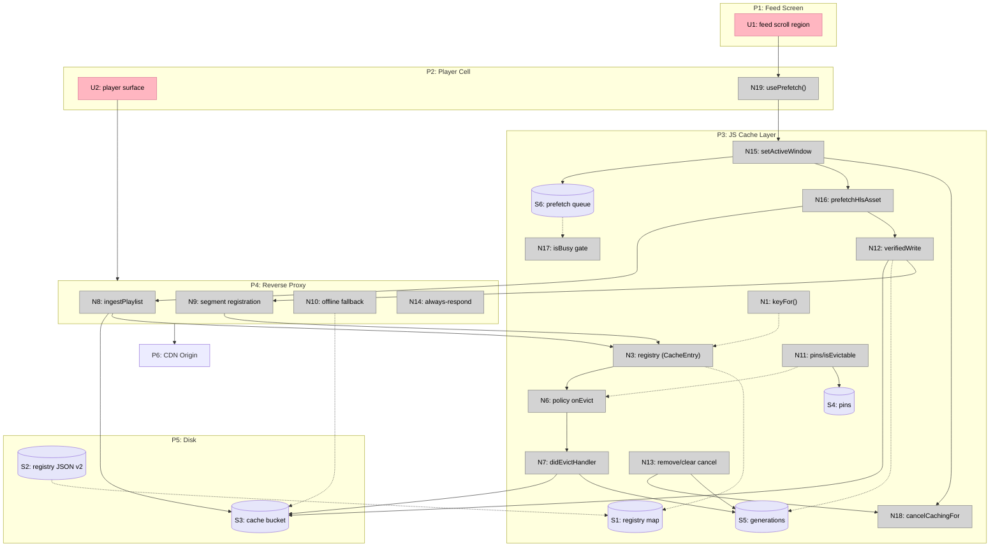

# HLS Caching Features — Breadboard

Tables are the truth; the Mermaid diagram is a visualization. Affordances marked ✚ are new,
✎ are modifications of existing code affordances.

## Places

| # | Place | Description |
|---|---|---|
| P1 | Feed Screen (example app) | Scrolling video list — the demo surface for prefetch |
| P2 | Player Cell | A playing video (`useAsyncCache` + `<Video>`) |
| P3 | JS Cache Layer | `CacheManager` + policies + registry (the library's backend) |
| P4 | Reverse Proxy | `BridgeServer` request handling (playlist + segment routes) |
| P5 | Disk | Cache bucket files + persisted registry JSON |
| P6 | CDN Origin | External signed-URL origin |

## UI Affordances

| # | Place | Component | Affordance | Control | Wires Out | Returns To |
|---|---|---|---|---|---|---|
| U1 | P1 | VideoList | feed scroll region (viewable-items change) | scroll | → N19 | — |
| U2 | P2 | Video | player surface (source uri) | render | → P4 media requests | ← N3 (cachedVideoUrl) |

## Code Affordances

| # | Place | Part | Affordance | Control | Wires Out | Returns To |
|---|---|---|---|---|---|---|
| N1 ✚ | P3 | A1 | `CacheKeyPolicy.keyFor(url)` | call | — | → every key site (N3–N9, N12, N15) |
| N2 ✚ | P3 | A1 | `CacheKeyPolicy.filePathFor(url)` | call | — | → N8, N9, N12 |
| N3 ✎ | P3 | A2 | registry `MemoryCacheProvider<CacheEntry>` | put/get | → N6 | → U2, S1 |
| N4 ✎ | P3 | A2 | `loadCacheFromStorage` v2-check + orphan sweep | call (server enable) | → S2 read, → S3 unlink | → S1 |
| N5 ✎ | P3 | A2 | `saveCacheToStorage` v2 export | call (disable/background) | → S2 write | — |
| N6 ✎ | P3 | A3 | policy `onEvict` (entry-aware, skips pinned) | access/put | → N7 | — |
| N7 ✎ | P3 | A3 | `didEvictHandler` HLS branch | call | → S3 unlink group, → S5 bump, discard event | — |
| N8 ✚ | P4 | A3 | `ingestPlaylist(originUrl)` (proxy + prefetch shared) | call | → S3 write playlist, → N3 upsert | → P4 response |
| N9 ✎ | P4 | A3 | segment registration under `__hls_owner` | call | → N3 upsert bytes | — |
| N10 ✚ | P4 | A3 | offline playlist fallback on origin error | call | → S3 read | → P4 response |
| N11 ✚ | P3 | A4 | pin refcounts `retain/release` + `isEvictable(key)` | call | → S4 | → N6 |
| N12 ✚ | P3 | A4 | `verifiedWrite` (temp → verify → generation-check → promote) | call | → S3 move/discard | → N9 |
| N13 ✎ | P3 | A4 | `removeCachedVideo`/`clearCache` cancel in-flight | call | → `cancelTask()`, → N18, → S5 bump | — |
| N14 ✚ | P4 | A4 | always-respond guard (`finally` → 503) | request end | → P4 response | — |
| N15 ✚ | P3 | A5 | `setActiveWindow(urls, i, opts)` window diff | call | → N16, → N18, → S6 | — |
| N16 ✚ | P3 | A5 | `prefetchHlsAsset(url, n)` playlist + first-N segments | call | → N8, → N12 | — |
| N17 ✚ | P3 | A5 | `isBusy()` playback-priority gate | poll (queue) | — | → S6 (stall) |
| N18 ✚ | P3 | A5 | `cancelCachingFor(url)` per-item cancel | call | → `.cancel()` in-flight | — |
| N19 ✚ | P2 | A6 | `usePrefetch()` hook | call | → N15 | → U1 |

## Data Stores

| # | Place | Store | Description |
|---|---|---|---|
| S1 | P3 | in-memory registry | `Map<normalizedKey, CacheEntry>` — media entries + HLS asset groups |
| S2 | P5 | persisted registry JSON | versioned (`version: 2`); non-v2 discarded on load |
| S3 | P5 | cache bucket files | playlists, segments (+ range variants), media, `.part` temps |
| S4 | P3 | pin map | `Map<key, refcount>` — in-use protection |
| S5 | P3 | generation map | `Map<key, n>` — evicted-while-downloading guard |
| S6 | P3 | prefetch queue | `{url, distance}[]`, distance-sorted, serial |

## Wiring Diagram

## B4 Verification

- Every data-displaying U has a source: U2 ← N3 ✅ (U1 is input-only)
- Every N has Wires Out or Returns To ✅
- Every S has a reader: S1←N3/N6 · S2←N4 · S3←N10/proxy reads · S4←N6(via N11) · S5←N12 · S6←queue runner ✅
- Disk side effects all route through N12 (single verified-write choke point) ✅
- Evict path (N6→N7) and write path (N12→N9) intersect only through S4/S5 guards — R4/R5 are structural, not conventional ✅

## Slicing

| # | Slice | Mechanisms | Requirements | Demo |
|---|---|---|---|---|
| V1 | Signed-URL cache hits | N1, N2 (+call-site swap), early S5 guard | R0, R1, R6(part) | "Play a CloudFront-signed video, rotate the signature, replay — served from cache, zero re-fetch" |
| V2 | HLS asset registry v2 | N3, N4, N5, N8, N9 | R2(part), R6 | "Play an HLS stream — registry shows ONE asset entry (playlist + N segments + byte total); relaunch with a v1 registry — discarded + orphans swept" |
| V3 | Whole-asset eviction + offline | N6, N7, N10 | R2, R3, R9 | "Two HLS assets under a small budget: cold one's playlist AND segments vanish together; airplane-mode replay of the hot one still starts" |
| V4 | Pin + cancel | N11, N12, N13, N14 | R4, R5, R10 | "Remove a downloading video — download cancels, nothing on disk, discard event fires; an in-use asset survives eviction pressure; a failed request returns 503, never hangs" |
| V5 | Window prefetch | N15, N16, N17, N18 | R7, R8 | "Feed of 10 URLs at index 5 — downloads run 5,6,7,4; scroll to 8 mid-flight — old cancels, new enqueues; active playback stalls the queue" |
| V6 | usePrefetch + example wiring | N19, U1 | R7, R11 | "Scroll the example feed — upcoming videos start instantly" |

6 slices (≤9 ✓). V1→V6 is also the dependency order; each slice lands green on its own
jest suites (the repo's in-memory blob-util VFS mock covers all of V1–V5 without native builds).
